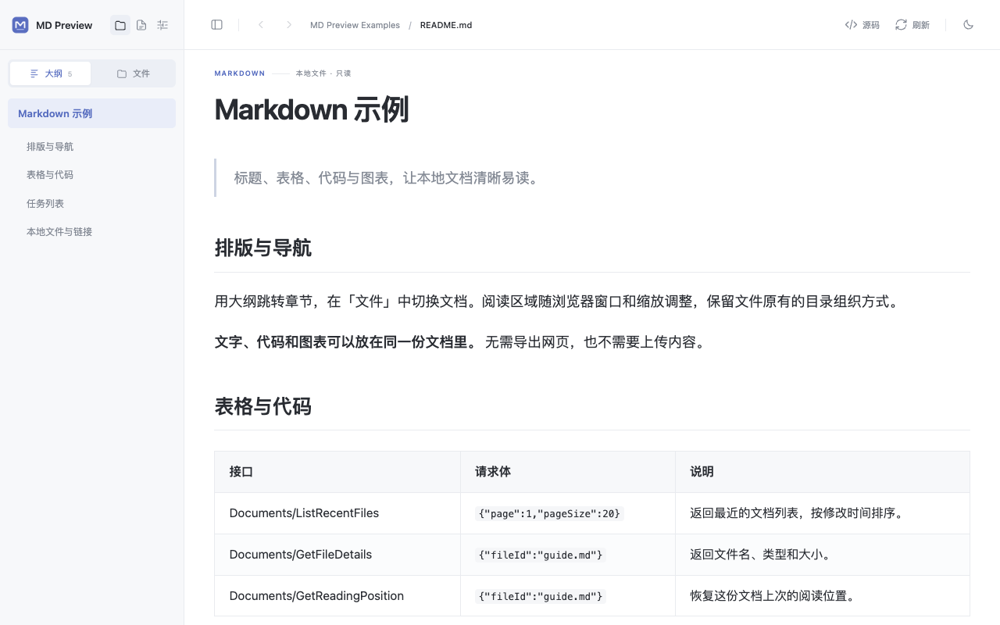
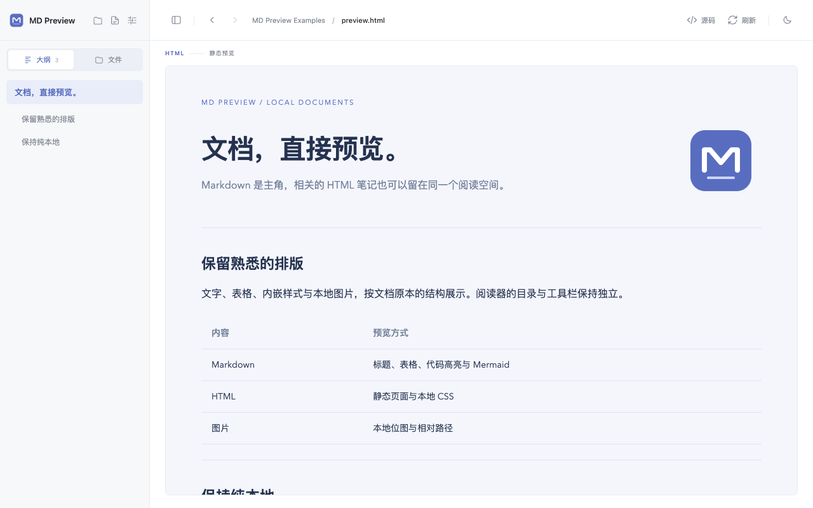

<p align="center"></p>

<p align="center"><a href="README.zh-CN.md">简体中文</a> · <a href="https://github.com/ketchupz1999/md-preview-extension/releases/latest">Download</a> · <a href="docs/PRIVACY.md">Privacy</a></p>

# MD Preview

Preview local Markdown in Chrome and Edge, with an outline, a file explorer, syntax highlighting, and Mermaid diagrams. All processing happens on your device.

The interface is in Simplified Chinese. Documents can contain any language.



## Features

- **Automatic preview.** Open local Markdown after enabling file URL access.
- **Document navigation.** An outline, a separate file tree, and filename search.
- **Readable content.** Tables, task lists, code highlighting, and Mermaid sequence diagrams, flowcharts, state diagrams, and ER diagrams.
- **Flexible layout.** Content fills the reading area at any browser zoom. Wide tables scroll within their own region; diagrams open in an enlarged view.
- **Reading tools.** Light and dark themes, source view, adjustable text size, automatic refresh, and reading-position recovery.
- **Related files.** Static HTML previews with supported local styles and images, plus CSS syntax highlighting and color swatches.

<details><summary>File explorer, diagrams, dark theme, and HTML preview</summary>




</details>

## Install

1. Download the ZIP from [Releases](https://github.com/ketchupz1999/md-preview-extension/releases/latest) and extract it to a permanent folder.
2. Open `chrome://extensions` or `edge://extensions` and enable **Developer mode**.
3. Choose **Load unpacked** and select the folder containing `manifest.json`.
4. Open the extension's **Details** and enable **Allow access to file URLs**.
5. Open a local `.md` file in your browser, or click the extension icon to choose a file or folder.

To update a manual installation, replace the files in the same folder and click **Reload** on the extensions page. The [`examples/`](examples) folder includes documents to try.

| Shortcut | Action |
| --- | --- |
| `⌘ / Ctrl + K` | Search files |
| `⌘ / Ctrl + B` | Toggle the sidebar |
| `Esc` | Close an enlarged diagram |

## Privacy

Files are read-only. MD Preview has no backend, account system, advertising, analytics, or telemetry. Rendering libraries are bundled; the reader blocks remote connections, scripts, images, and fonts.

The browser stores your most recent local file or folder reference, reading position, and preferences. Document contents are not persistently cached or uploaded. See the [privacy policy](docs/PRIVACY.md) for data handling and controls.

## Compatibility

Desktop Chrome and Edge 121 or later. Markdown extensions: `.md`, `.markdown`, `.mdown`, `.mkd`, and `.mdx`. MDX components and raw Markdown HTML are not executed. HTML previews are static; remote documents, interactive scripts, standalone SVG files, and math typesetting are not supported.

## Development

Requires Node.js 22.12 or later. Installing dependencies needs internet access; running the extension does not.

```sh
npm ci
npm run check
npx playwright install chromium
npm run test:browser
npm run test:files
npm run test:html
npm run package
```

Load `dist/` for development. The installable ZIP is written to `release/`. See [Development](docs/DEVELOPMENT.md) and [Chrome Web Store assets](docs/chrome-store/README.md).

Report bugs or suggest improvements through [Issues](https://github.com/ketchupz1999/md-preview-extension/issues).

## License

[MIT](LICENSE). Every build includes third-party license notices.
