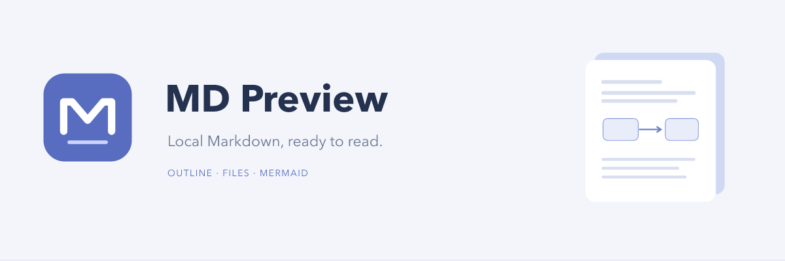
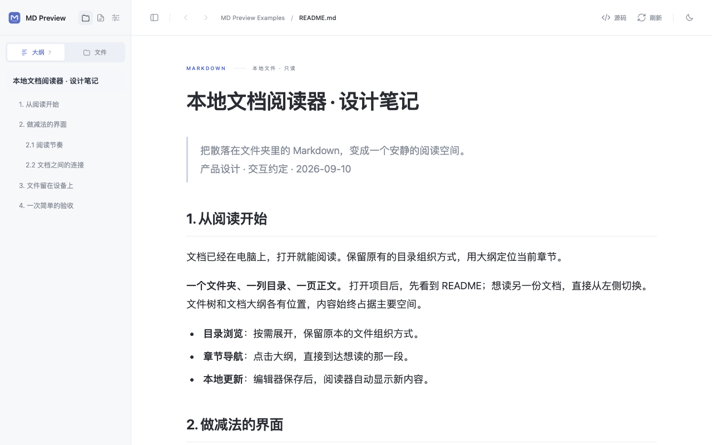
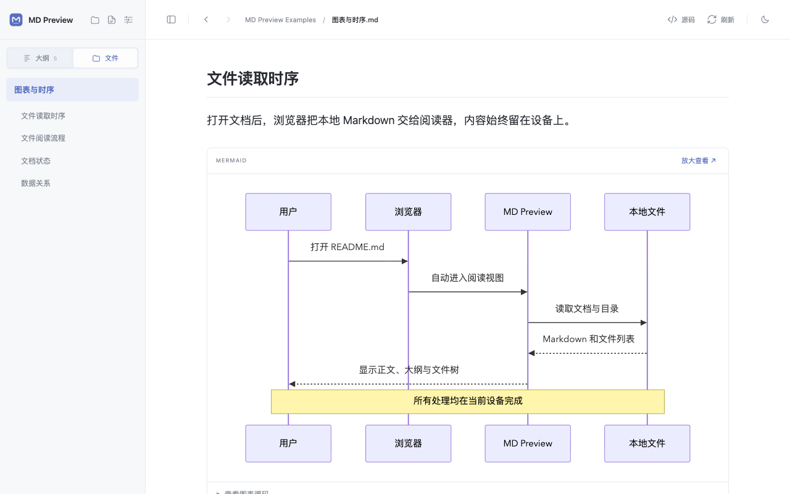
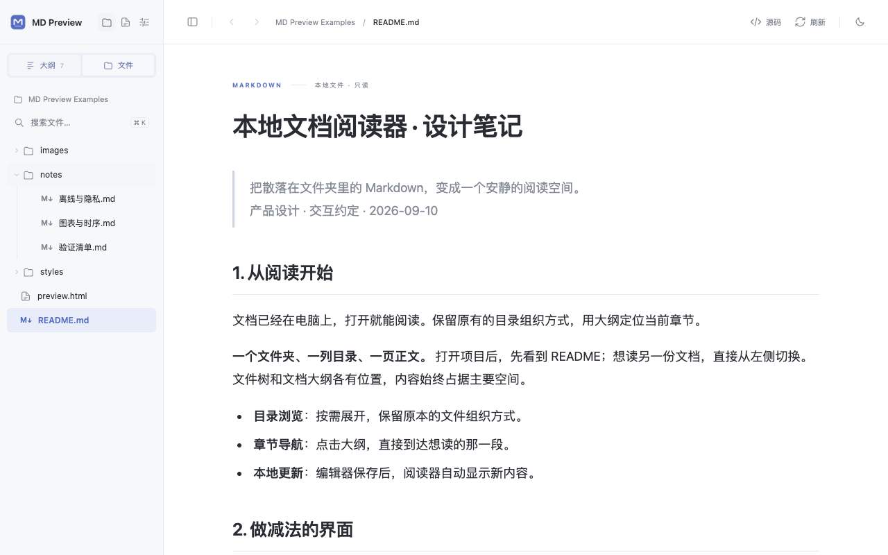
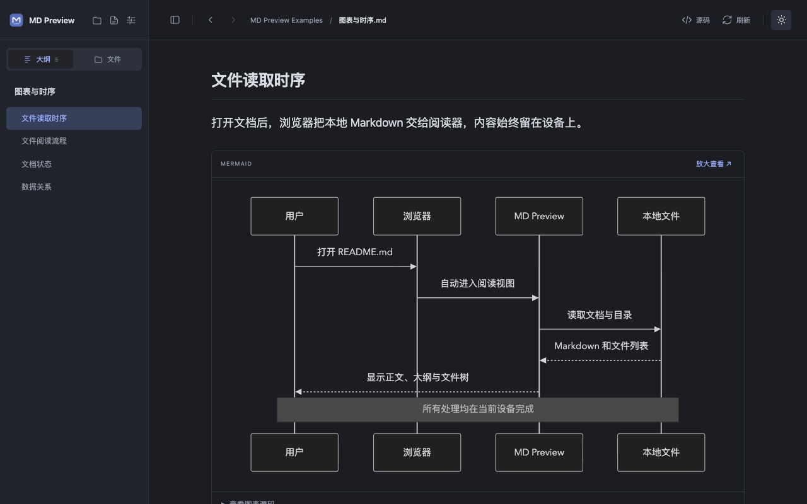
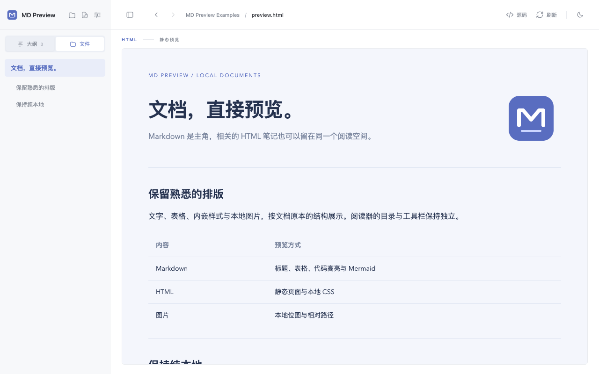

<p align="center"></p>

<p align="center"><a href="README.zh-CN.md">简体中文</a> · <a href="https://github.com/ketchupz1999/md-preview-extension/releases/latest">Download</a> · <a href="docs/PRIVACY.md">Privacy</a></p>

# MD Preview

Preview local Markdown in Chrome and Edge. Open a `.md` file and start reading, with an outline, a file explorer, syntax highlighting, and Mermaid diagrams. Everything runs on your device.

The current interface is in Simplified Chinese. The Chrome Web Store listing is being prepared; the extension can already be installed from a release ZIP.

## Features

- **Open and read.** Automatically previews local Markdown after you enable file URL access.
- **Navigate your documents.** A compact outline by default, with a separate file tree and filename search.
- **See the structure.** Tables, task lists, code highlighting, Mermaid sequence diagrams, flowcharts, and more. Enlarge diagrams when you need a closer look.
- **Stay local.** Read-only files, bundled libraries, no accounts, no analytics, and no HTTP/HTTPS requests from the reader.
- **Keep your workflow.** Light and dark themes, source view, adjustable text size, automatic refresh, and reading-position recovery. Linked local HTML documents have a static preview; CSS files include color swatches.



<details><summary>Mermaid diagrams, file explorer, dark mode, and HTML preview</summary>






</details>

## Install

1. Download `md-preview-*.zip` from [Releases](https://github.com/ketchupz1999/md-preview-extension/releases/latest) and extract it.
2. Open `chrome://extensions` in Chrome, or `edge://extensions` in Edge. Enable **Developer mode**.
3. Choose **Load unpacked** and select the extracted folder containing `manifest.json`.
4. Open the extension's **Details** and enable **Allow access to file URLs**.
5. Open a local `.md` file in your browser. MD Preview will display the document and its surrounding folder.

You can also open a file or folder from the extension toolbar. To update, replace the contents of the same extension folder and click **Reload** on the extensions page.

Try the included [`examples/`](examples) folder. `⌘ / Ctrl + K` opens file search, `⌘ / Ctrl + B` toggles the sidebar, and `Esc` closes a diagram preview.

## Local by design

MD Preview requests access only to `file:///*`, not websites. Its content security policy blocks network connections and remote resources. Markdown HTML is displayed as text. HTML file previews are sanitized and sandboxed with scripts, navigation, forms, and remote resources disabled.

The browser stores your most recent file or folder reference, reading position, and preferences locally. Document contents are not cached in extension storage or sent to the developer. See the [privacy policy](docs/PRIVACY.md) and [implementation notes](docs/DEVELOPMENT.md) for exact behavior and limits.

## Develop

Requires Node.js 22.12 or later. Installing dependencies needs internet access; running the extension does not.

```sh
npm ci
npm run check
npx playwright install chromium
npm run test:browser
npm run test:files
npm run test:html
npm run package
```

Load `dist/` as an unpacked extension. The release ZIP is written to `release/`. [Development notes](docs/DEVELOPMENT.md) include architecture, limits, and test details. [Chrome Web Store materials](docs/chrome-store/README.md) include listing copy, reviewer instructions, and correctly sized images.

Bug reports and small, focused contributions are welcome through [Issues](https://github.com/ketchupz1999/md-preview-extension/issues) and pull requests.

## License

[MIT](LICENSE). Third-party notices are included in every extension build.
