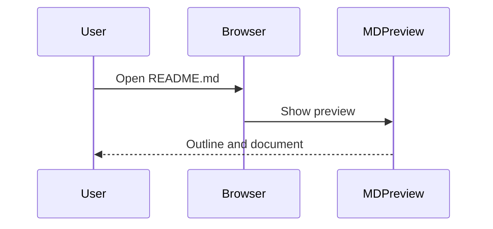

# Reviewer and privacy notes

## Single purpose

Provide read-only previews and navigation for local Markdown documents. The outline, local file explorer, Mermaid diagrams, and static previews of related local HTML documents all support this single purpose: reading local documentation.

## Permission justification

**`file:///*` host access**

Users can open Markdown from any local folder. The extension reads the selected local Markdown file, its parent directory listing for the explorer, and supported local files referenced by the document. Chrome separately requires the user to enable “Allow access to file URLs.” HTTP/HTTPS host permissions are not requested.

**Local content script**

The content script matches local file pages, checks that the top-level URL has a supported Markdown extension, and asks the extension worker for its own reader URL. Other local text/HTML pages and remote websites are not automatically replaced. The worker validates the browser-supplied sender URL, extension ID, frame, and tab. Navigation replaces the original Markdown history entry so Back works normally.

**Web-accessible `reader.html`**

Only the reader HTML navigation entry is exposed to local file origins. The worker's validated response lets the local content script replace the raw Markdown page with the extension reader. The reader cannot be embedded by another page (`frame-ancestors 'none'`); this entry exposes no file-reading API to websites.

## Remote code

No remotely hosted code is used. Markdown-it, Highlight.js, Mermaid, DOMPurify, and Preact are bundled during build. Dynamic diagram modules load from the extension package. There is no CDN, eval-based code loader, remote configuration, analytics SDK, or backend.

## Data handling

Local document contents, file names, and directory listings are processed on the device for the user's preview. Nothing is transmitted to the developer or a third party. One recent file/folder reference, document path, scroll position, and reading preferences are stored in browser-local storage. Document bodies are not persistently cached by the extension and Chrome sync storage is not used.

The dashboard disclosures must include local processing; no transmission is required for Google's disclosure obligation to apply. The current submission maps document text and images to Website content, saved reading position to User activity, and the most recent local file URL to Web history. This mapping describes local document reading only: the extension does not query Chrome's browsing-history database, track visits to remote websites, or send activity to the developer. It does not sell data, use it for unrelated purposes, or use it for creditworthiness or lending.

These category mappings are our assessment of the current implementation and the form definitions. The publisher must review the current dashboard's definitions and certifications before submitting. See [Google's User Data FAQ](https://developer.chrome.com/docs/webstore/program-policies/user-data-faq).

## Test instructions

No login, payment, backend, or credentials are needed to test the extension. The interface is currently in Simplified Chinese: 大纲 means Outline, 文件 means Files, 源码 means Source, and 刷新 means Refresh. Store descriptions and these reviewer instructions are in English.

1. Install the extension, open its Details, and enable **Allow access to file URLs**.
2. Create a local Markdown file with the sample below. Open it as a file URL in Chrome.
3. Confirm that the rendered document appears with an outline. Switch to the file Tab to view sibling files and search names.
4. Open the Mermaid diagram in the enlarged view, change themes, and toggle source view.
5. Edit the local file, save it, and keep the reader visible; it detects the changed document. The refresh control also updates the directory.
6. The remote image below stays unloaded. The external link is copied when clicked and is not opened by the reader.

````markdown
# MD Preview test

## Markdown

- [x] Local preview
- [ ] More notes

| File | Purpose |
| --- | --- |
| README.md | Project notes |

```javascript
const preview = { local: true, readOnly: true };
```

## Mermaid




[External link only copies the address](https://example.com/)
````

HTML previews are intentionally static, isolated from the reader's styles, and have no script/form/navigation capability. Math typesetting, remote documents, and CSS imports are not supported in this release.
