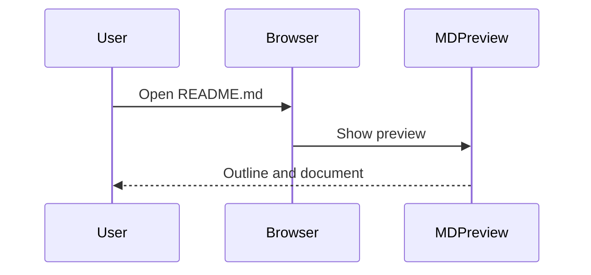

# Reviewer guide

## Single purpose

Provide read-only previews and navigation for local Markdown documents. The outline, local file explorer, Mermaid diagrams, and static previews of related local HTML documents all support this single purpose: reading local documentation.

## File access

The extension uses `file:///*` because users can open Markdown from any local folder. It reads the opened file, its surrounding directory listing, and supported local document references. Chrome separately requires the user to enable **Allow access to file URLs**. HTTP/HTTPS hosts and network file shares are not allowed.

The content script replaces only top-level local Markdown pages. The service worker validates the browser-supplied sender URL, frame, and extension ID. The web-accessible `reader.html` is a navigation entry for local pages and exposes no file-reading API to websites.

Manual folder selection uses read-only File System Access handles. References in this mode are confined to the selected root. Source files are never edited or deleted.

## Remote code

No remotely hosted code is used. Markdown-it, Highlight.js, Mermaid, DOMPurify, and Preact are bundled in the extension. Diagram modules load from the extension package. There is no CDN, eval-based code loader, remote configuration, analytics SDK, or backend.

## Data handling

| Dashboard category | Scope |
| --- | --- |
| Website content | Opened local document text, images, and supported styles, processed for preview |
| User activity | Local reading position used to resume reading |
| Web history | The most recent local file URL/reference used to reopen a document |

All processing and storage stay on the user's device. The extension does not query Chrome's browsing-history database, track visits to remote sites, persist document bodies, use Chrome sync storage, or transmit data to the developer or third parties. It does not sell data, use it for unrelated purposes, or use it for creditworthiness or lending.

These categories describe the extension's local document-reading functions under the dashboard definitions. Local-only handling still requires disclosure under [Google's User Data FAQ](https://developer.chrome.com/docs/webstore/program-policies/user-data-faq). The user-facing policy is [PRIVACY.md](../PRIVACY.md).

## Test instructions

No login, payment, server, or credentials are needed. The interface is in Simplified Chinese: 大纲 means Outline, 文件 means Files, 源码 means Source, and 刷新 means Refresh.

1. Install the extension, open its Details, and enable **Allow access to file URLs**.
2. Save the Markdown below as a local `.md` file and open its file URL in Chrome.
3. Check the formatted document and outline. Switch to Files to browse sibling files and search filenames.
4. Enlarge the Mermaid diagram, switch themes, and toggle Source view.
5. Change browser zoom to 80%, 50%, or 25%. The reader continues to fill the available width. Wide tables scroll within their own region.
6. Edit and save the local file. A visible reader tab detects changes automatically; Refresh also updates the directory.
7. The remote image stays unloaded. Clicking the external link copies its address without opening the website.

````markdown
# MD Preview example

## Markdown

- [x] Read a local document
- [ ] Add another note

| File | Purpose |
| --- | --- |
| README.md | Project notes |

```javascript
const preview = { local: true, readOnly: true };
```

## Mermaid




[External link only copies the address](https://example.com/)
````

HTML previews are static and sandboxed. Scripts, forms, navigation, and remote resources are disabled. Math typesetting, remote documents, and CSS imports are not supported.
