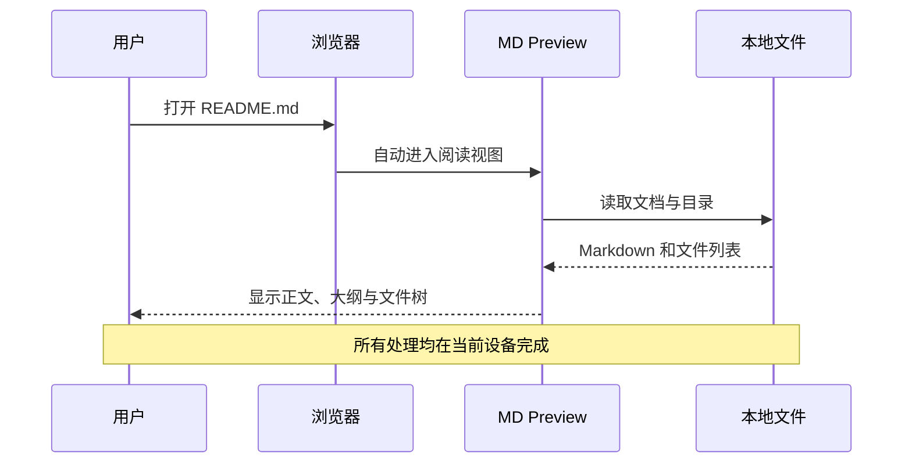
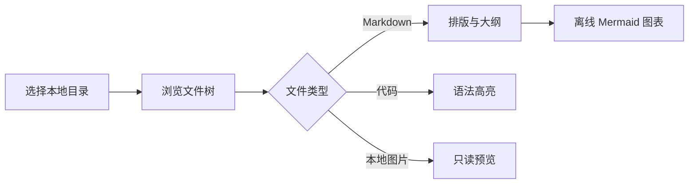
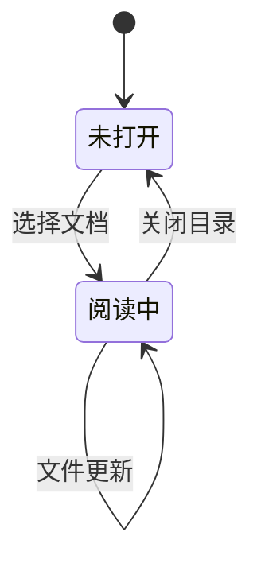
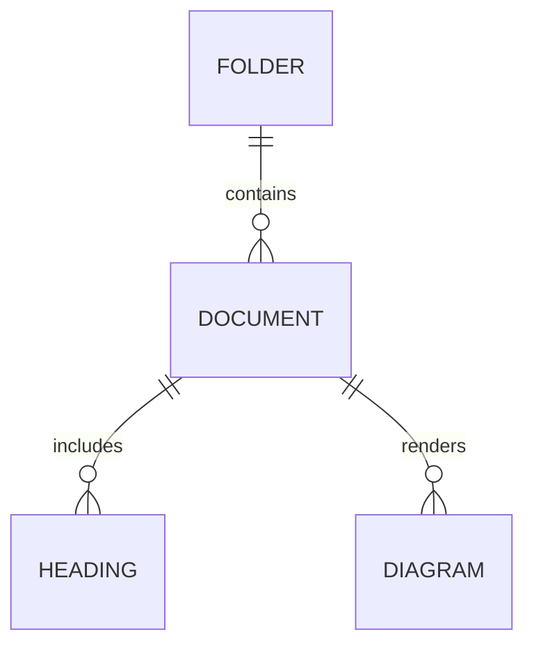

# 图表与时序

## 文件读取时序

打开文档后，浏览器把本地 Markdown 交给阅读器，内容始终留在设备上。

```mermaid
sequenceDiagram
    participant U as 用户
    participant B as 浏览器
    participant R as MD Preview
    participant F as 本地文件
    U->>B: 打开 README.md
    B->>R: 自动进入阅读视图
    R->>F: 读取文档与目录
    F-->>R: Markdown 和文件列表
    R-->>U: 显示正文、大纲与文件树
    Note over U,F: 所有处理均在当前设备完成
```

## 文件阅读流程

```mermaid
flowchart LR
    A[选择本地目录] --> B[浏览文件树]
    B --> C{文件类型}
    C -->|Markdown| D[排版与大纲]
    C -->|代码| E[语法高亮]
    C -->|本地图片| F[只读预览]
    D --> G[离线 Mermaid 图表]
```

## 文档状态

```mermaid
stateDiagram-v2
    [*] --> 未打开
    未打开 --> 阅读中: 选择文档
    阅读中 --> 阅读中: 文件更新
    阅读中 --> 未打开: 关闭目录
```

## 数据关系

```mermaid
erDiagram
    FOLDER ||--o{ DOCUMENT : contains
    DOCUMENT ||--o{ HEADING : includes
    DOCUMENT ||--o{ DIAGRAM : renders
```

[返回设计笔记](../README.md)
